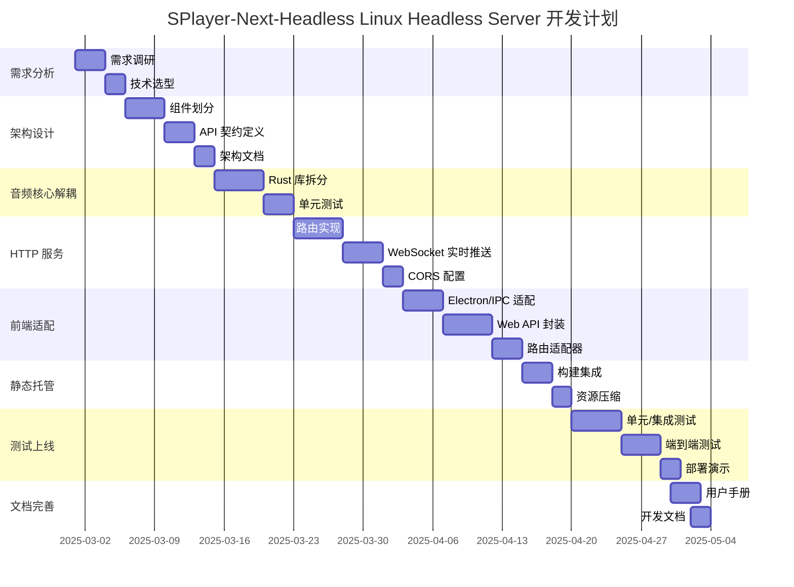

# Linux 无头服务器平台开发计划

## 1. 项目背景与目标概述

### 背景
现有 SPlayer-Next-Headless 项目为跨平台音乐播放器，支持 Windows/macOS/Linux 桌面版，具备完整的 Vue UI、Electron 架构和 Rust 音频核心。用户需求：在保留原有平台能力的前提下，新增 纯 Rust HTTP 服务 ，允许 Web UI 独立运行于任何设备上访问，而无需安装 Electron。

### 目标
1. 解耦音频核心库，使其可被 Rust HTTP 服务直接调用。
2. 实现纯 Rust HTTP/WebSocket API 服务，提供轨道控制、音量、歌单、歌词等功能。
3. 静态托管现有 Vue Web UI，实现前后端分离部署。
4. 保持 Windows/macOS/Linux 桌面版零改动，确保向后兼容。
5. 部署演示版于 Linux 云服务器，演示 Web UI 远程控制播放器。

---

## 2. 功能模块划分

| 模块 | 负责人 | 技术栈 | 依赖 |
|------|--------|--------|------|
| 音频核心库解耦 | Rust 后端工程师 | Rust, Cargo, NAPI-RS | audio-engine、audio-capture |
| HTTP 服务后端 | Rust 后端工程师 | Axum, Tokio, WebSocket | audio-engine-core |
| 数据库持久化 | Rust 后端工程师 | rusqlite, serde | Rust 库 |
| Vue 前端适配层 | 前端工程师 | TypeScript, Pinia | Web API |
| 静态资源托管 | 前端工程师 | Vite, Axum ServeDir | Vue 构建产物 |
| 配置文件管理 | 全员 | YAML/JSON | 通用 |
| 单元/集成测试 | 测试工程师 | cargo test, vitest, playwright | 各模块 |
| CI/CD 镜像部署 | DevOps | GitHub Actions, Docker | 所有模块 |

---

## 3. 开发阶段与时间节点

---

## 4. 资源分配

| 角色 | 人数 | 关键职责 |
|------|------|----------|
| Rust 后端工程师 | 1 | audio-engine-core 解耦、API 服务、WebSocket、CORS、配置文件 |
| 前端工程师 | 1 | Vue 适配层、API 封装、Web API、静态托管 |
| 测试工程师 | 1 | 单元/集成/端到端测试、CI/CD 编写、质量报告 |
| DevOps | 0.5 | 镜像构建、部署脚本、监控告警 |

---

## 5. 任务分解与责任人分配

### 5.1 Rust 核心解耦 (编号 `C-1` ~ `C-8`)

| 编号 | 任务 | 负责人 | 前置 | 后置 | 产出 |
|------|------|--------|------|------|------|
| C-1 | 分析 audio-engine.cdylib 依赖关系 | Rust | 需求调研 | C-2 | 依赖图 |
| C-2 | 提取 `audio-engine-core` 纯 Rust 库 | Rust | C-1 | C-3 | `/native/audio-engine-core/rustlib` |
| C-3 | 为原 NAPI wrapper 添加 Cargo feature | Rust | C-2 | C-4 | `Cargo.toml` feature |
| C-4 | 为 Headless Server 添加 Cargo workspace 成员 | Rust | C-3 | C-5 | 根 Cargo.toml |
| C-5 | 编写 `audio-engine-core` 单元测试 | Rust | C-4 | C-6 | `audio-engine-core/tests` |
| C-6 | CI 流水线编译纯 Rust 库 | DevOps | C-5 | C-7 | 编译产物 |
| C-7 | 在 Linux 无头环境跑通播放器 | Rust | C-6 | C-8 | 本地 Demo |
| C-8 | 更新 NAPI wrapper 以链接新库 | Rust | C-7 | 完成 | 只影响无头编译 |

### 5.2 HTTP 服务后端 (编号 `D-1` ~ `D-6`)

| 编号 | 任务 | 负责人 | 前置 | 产出 |
|------|------|--------|------|------|
| D-1 | 设计 RESTful API 契约 | Rust | API 契约定义 | `docs/api.md` |
| D-2 | 实现路由框架 (Axum + Tokio) | Rust | D-1 | `/server-rust/src/api/routes.rs` |
| D-3 | 实现播放控制接口 | Rust | D-2 | `/api/v1/player/{load,play,pause,...}` |
| D-4 | 实现 WebSocket 实时推送 | Rust | D-2 | `/ws` 端点 |
| D-5 | 设置 CORS 生产环境白名单 | Rust | gate.ts 逻辑 | 环境变量驱动 |
| D-6 | 集成配置文件与数据库 | Rust | D-3 | `config.yaml` + SQLite |

### 5.3 前端适配 (编号 `E-1` ~ `E-4`)

| 编号 | 任务 | 负责人 | 前置 | 产出 |
|------|------|--------|------|------|
| E-1 | 抽象统一客户端接口 | 前端 | 需求分析 | `src/services/client.ts` |
| E-2 | 实现 Electron/IPC 实现 | 前端 | E-1 | `electronClient.ts` |
| E-3 | 实现 Web/HTTP 实现 | 前端 | E-1 | ` httpClient.ts` |
| E-4 | 运行时自动选型 | 前端 | E-2,E-3 | 首页 `main.ts` 集成 |

### 5.4 静态托管 (编号 `F-1`)

| 编号 | 任务 | 负责人 | 产出 |
|------|------|--------|------|
| F-1 | 前端构建产物托管集成 | 前端 | `--web-root` 参数 + ServeDir |

### 5.5 测试 (编号 `G-1` ~ `G-3`)

| 编号 | 任务 | 负责人 | 产出 |
|------|------|--------|------|
| G-1 | Rust 单元/集成测试 | 测试 | 80% 覆盖率 |
| G-2 | 前端单元/端到端测试 | 测试 | vitest + playwright |
| G-3 | 部署环境端到端验证 | 测试 | 演示视频 |

---

## 6. 关键技术难点及解决方案

| 难点 | 解决方案 | 负责人 |
|------|----------|--------|
| 音频核心 NAPI 依赖 | 将 `audio-engine` 核心逻辑抽离为 `audio-engine-core` 库，NAPI wrapper 仅作包装 | Rust |
| 跨进程状态同步 | WebSocket 推送播放器状态，单向推送（Server→Client） | Rust |
| 数据库迁移冲突 | Headless Server 使用独立数据库文件，Electron 继续使用副本 | Rust |
| CORS 令牌绕过问题 | 调整 gate.ts 逻辑：TOKEN 校验必须在 `externalApi.enabled` 之后 | Rust |
| Vue IPC 适配 | 统一接口 `client.play()` 自动分支 Electron/Web | 前端 |
| 静态资源压缩 | Vite `build.assetsInlineLimit` 调整，Axum `CompressionLayer` | 前端 |
| 容器化部署 | Dockerfile 基于 `debian:bookworm-slim` + `libasound2` 依赖 | DevOps |

---

## 7. 质量保障措施

### 7.1 代码审查流程

- **PR 大小限制**：≤ 400 行变更
- **审查人数**：至少 1 位以上位成员
- **CI 必须通过**：cargo fmt、clippy、vitest、eslint
- **提交消息**：遵循 [Conventional Commits](https://www.conventionalcommits.org/)

### 7.2 测试策略

| 测试类型 | 工具 | 目标覆盖率 | 触发时机 |
|----------|------|------------|----------|
| Rust 单元测试 | cargo test | 80% 代码 | 每次提交 |
| 前端单元测试 | vitest | 70% 组件 | 每次提交 |
| 集成测试 | cargo test + playwright | 关键路径 | PR 合并前 |
| E2E 测试 | playwright | 全流程 | 每日 CI |
| 安全扫描 | cargo audit | 依赖漏洞 | 每日 CI |

### 7.3 CI/CD 流水线

- GitHub Actions 工作流文件：`.github/workflows/`
- 触发条件：push、pull_request、tag
- 部署阶段：演示版自动部署至测试服务器

---

## 8. 风险管理计划

| 风险 | 概率 | 影响 | 缓解措施 |
|------|------|------|----------|
| Rust 库不可在无头环境编译 | 高 | 项目停滞 | 提前 7 天完成音频核心解耦 |
| Web UI 功能缺失 | 中 | 用户反馈差 | 拆分为 MVP 需求列表，优先实现 80% 核心功能 |
| 跨域/令牌安全漏洞 | 中 | 服务被滥用 | 环境变量 Token；生产态部署前进行安全审计 |
| 依赖冲突（better-sqlite3） | 低 | 编译失败 | 采用 rusqlite；CI 环境使用与生产相同的系统库 |
| 容器镜像体积过大 | 低 | 部署慢 | 多阶段构建；`distroless` 静态链接 |

---

## 9. 沟通协作机制

| 场景 | 频率 | 渠道 | 记录方式 |
|------|------|------|----------|
| 日常任务同步 | 每日 | Discord + GitHub Projects | GitHub Issue 评论 |
| 周报例会 | 每周 | Discord 语音 | 会议纪要 Wiki |
| 代码评审 | 持续 | PR 评论 | GitHub PR |
| 需求调试 | 持续 | Discord 语音 + VS Code Live Share | 会议录屏 |

---

## 10. 项目交付标准与验收 Criteria

### 10.1 功能验收

| 功能 | 验收标准 |
|------|----------|
| 音频播放 | 支持本地文件、网易云/Music、Kugou 等歌曲，播放/暂停/快进/快退 |
| 歌词同步 | 歌词在歌曲播放时实时滚动，支持滚动到当前位置 |
| WebSocket 推送 | 每 500ms 上报一次播放状态（position、volume、state） |
| REST API | 所有播放控制、歌单、歌词均可通过 HTTP 完成 |
| 静态托管 | 前端单页面路由（history模式）404 正常返回 index.html |
| CORS 令牌 | 生产环境域名访问 CORS 正常，错误 Token 返回 401 |

### 10.2 性能验收

| 指标 | 阈值 | 测试方法 |
|------|------|----------|
| 启动耗时 | ≤ 3 秒 | 本地容器启动计时 |
| 内存占用 | ≤ 150 MB | `ps aux` 观察 |
| CPU 占用 | 空闲 ≤ 2%，播放 ≤ 15% | `top` 观察 |
| HTTP 响应 | 95% ≤ 100ms | `ab -n 1000 -c 10` |

### 10.3 部署验收

| 环节 | 验收标准 |
|------|----------|
| Docker 镜像 | 构建成功，镜像 ≤ 250 MB |
| 系统服务 | `systemctl status splayer-headless` running |
| 防火墙 | 外网访问 `http://<IP>:14558/api/status` 正常返回 |

### 10.4 文档验收

| 文档 | 完成标准 |
|------|----------|
| API 文档 | OpenAPI 3.0 JSON 文件，文档站点 |
| 部署手册 | 1 页快速上手 + 1 页配置说明 |
| 开发指南 | 如何在本机启动 Headless 服务 |

---

## 附录：里程碑时间表

| 里程碑 | 日期 | 交付物 |
|--------|------|--------|
| M0 需求完成 | 2025-03-13 | API 契约、技术选型文档 |
| M1 核心解耦完成 | 2025-03-20 | audio-engine-core 纯库 |
| M2 HTTP 服务功能完成 | 2025-04-01 | REST + WebSocket 端点 |
| M3 前端适配完成 | 2025-04-12 | Universal Client |
| M4 测试通过 | 2025-04-25 | 单元/集成/E2E 测试报告 |
| M5 公开演示 | 2025-05-05 | 部署好的云服务器演示链接 |
| 完结交付 | 2025-05-10 | 完整文档、二进制发布 |